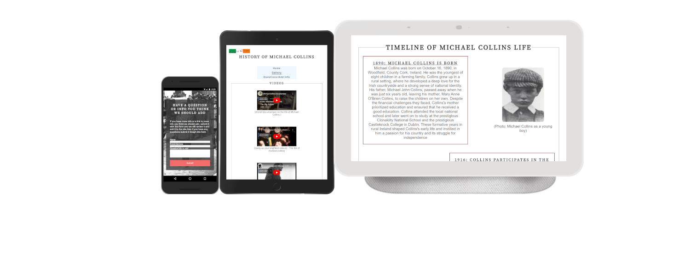
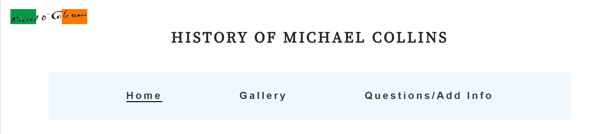
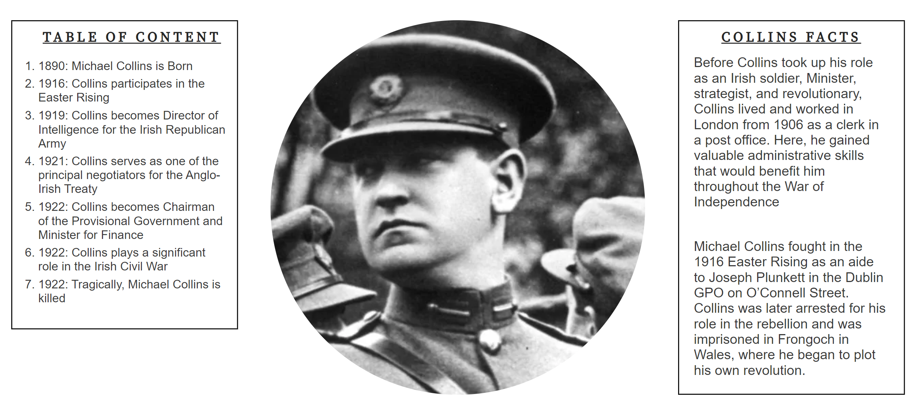
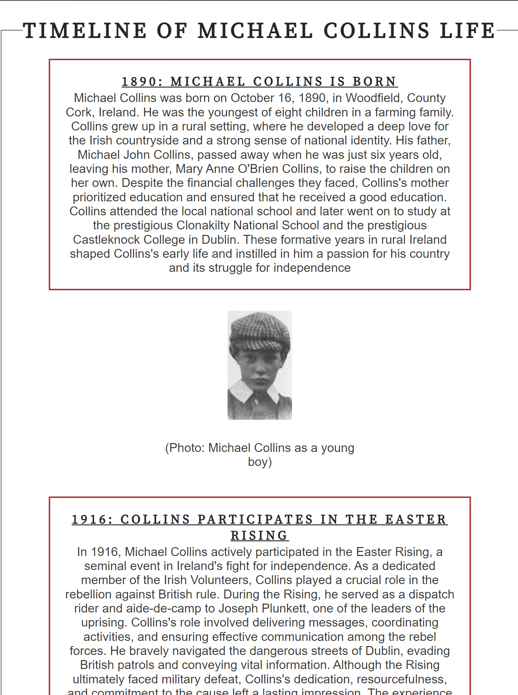
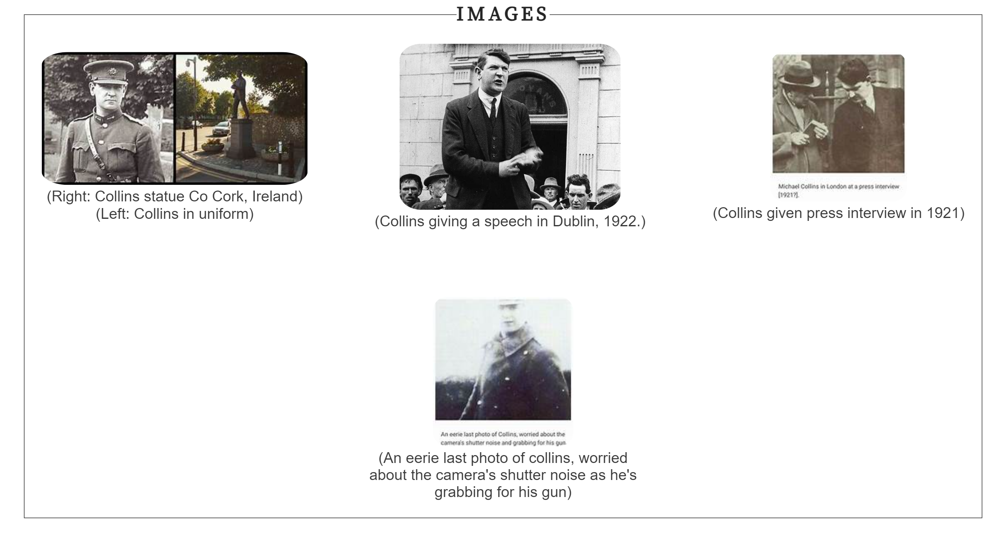
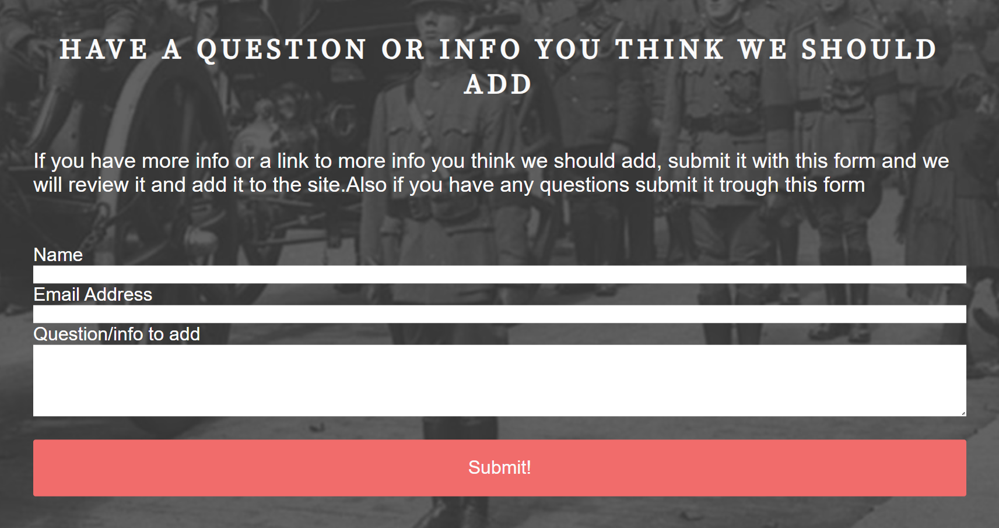

Welcome to, 
# HISTOTY OF MICHAEL COLLINS

This website provides a comprehensive overview of the life and accomplishments of Michael Collins, an influential figure in Irish history. From his role in the Irish War of Independence to his political career, this website aims to educate and inform visitors about the significant contributions made by Michael Collins. Here, you will find a wealth of information and resources about Collins, his role in shaping Irish history, and his enduring legacy.

The last update to this file was: **June 10th, 2023**

## Features
In this section we go over the features of the website, and show examples of the different sections.

### Homepage
The Homepage offers an interactive visual representation of the significant events in Michael Collins' life. It allows users to navigate through key milestones and gain a better understanding of the chronology of his accomplishments and challenges.

### Gallery
For those interested in further exploration, the Gallery section provides some images, documentaries, and websites related to Michael Collins and Irish history. These resources offer additional perspectives and insights into the subject matter.

### Questions/Add Info 
We welcome contributions from individuals who would like to enhance the website's content and features. Whether you have suggestions for improvement, additional information, or would like to report an issue, please refer to our Questions/add info page and enter the details on the form and submit it.

### Existing Features

- __Header navigation bar__

  - Featured on all three pages, the full responsive navigation bar includes links trough the Logo, Home page, Gallery and Questions/Add Info page, website name and is identical in each page to allow for easy navigation.
  - This section will allow the user to easily navigate from page to page across all devices without having to revert back to the previous page via the ‘back’ button. 

- __Table of contents section__

  - The table of content's has links to each section of the timeline of Michael Collins life
  - This section introduces the user to information about Michael Collins also with an image of Michael Collins and some interesting facts

- __Timeline__

  - The timeline section has multiple seperate paragraghs leading the user through Michael Collins life. 
  - There is an image relating to each paragraph with a description so the user can really get a feel for Michael Collins life. 

- __The Footer__ 

  - The footer section includes links to the relevant social media sites for the History of Michael Collins. The links will open to a new tab to allow easy navigation for the user. 
  - The footer is valuable to the user as it encourages them to keep connected via social media

- __Gallery__

  - The gallery will provide the user with supporting images with description and also embeded youtube documentary videos to provided more insight into Collins life. 
  - This section is valuable to the user as they will get a lot more information about collins and a better feel for what it was like in collins time. 

- __Questions/Add info__

  - This page will allow the user submit more info that they think we should add to the site, or ask any question they have. The user will be asked to submit their full name, email address and question or info to be added. 

### Features Left to Implement

- Another feature idea we are thinking of implementing is another page for links to more information on collins and maybe more influenical irish figures in history.

## Testing 

During the testing phase, comprehensive evaluations were conducted on the website to ensure its functionality, usability, and performance. A series of rigorous tests were performed, encompassing various aspects such as user interface, navigation, responsiveness, and data validation. By meticulously exploring the website's features and functionalities, we aimed to identify any potential issues or bugs that might hinder its optimal performance.

The testing process involved both manual and automated techniques. Manual testing allowed for a hands-on examination of the website's interface, user interactions, and overall user experience. This approach enabled us to detect any visual anomalies, usability concerns, or inconsistencies in the flow of the application.

Automated testing was employed to ensure the stability and reliability of the website across different browsers, devices, and operating systems. By utilizing testing frameworks and tools, we executed a comprehensive suite of automated tests to verify the website's compatibility, responsiveness, and adherence to web standards.

Throughout the testing phase, any issues discovered were diligently documented and reported. This documentation includes clear descriptions of the problems, steps to reproduce them, and their impact on the website's functionality. The identified issues were then addressed by the development team, followed by retesting to confirm the effectiveness of the resolutions.

By performing rigorous testing on the website, we have taken significant steps towards delivering a robust and high-quality user experience. The insights gained from the testing process have not only helped identify and resolve issues but have also contributed to enhancing the overall performance and usability of the website.

### Validator Testing 

- HTML
  - No errors were returned when passing through the official [W3C validator]()
- CSS
  - No errors were found when passing through the official [(Jigsaw) validator]()

### Unfixed Bugs

The form section is currently not able to be submitted as it needs javascript and python to send the data and as this website is for education purposes we have not learnt these languages yet, but will be updated in the future.

## Deployment

This section should describe the process you went through to deploy the project to a hosting platform (e.g. GitHub) 

- The site was deployed to GitHub pages. The steps to deploy are as follows: 
  - In the GitHub repository, navigate to the Settings tab 
  - From the source section drop-down menu, select the Master Branch
  - Once the master branch has been selected, the page will be automatically refreshed with a detailed ribbon display to indicate the successful deployment. 

The live link can be found here - https://code-institute-org.github.io/love-running-2.0/index.html 

## Credits 

Here we credit everywhere we have got content for the website and any code that was taken from other sources.

### Content 

- The text for the Home page was taken from ChatGPT.
- The icons in the footer were taken from [Font Awesome](https://fontawesome.com/)

### Media

- Videos in the gallery where taken from Youtube here is the links to eace channel in order
 1. [Michael Collins House Museum](https://www.youtube.com/@michaelcollinshouse)
 2. [Diolún Ó hUigínn](https://www.youtube.com/@Dioluin)
 3. [Documentales Olvidados](https://www.youtube.com/@Documentalesolvidado)

- The images in the gallery were taken from these pages in order
 1. [Michael collins statue in cork](https://laracurtis.blogspot.com/2021/04/michael-collins-ireland-history-michael.html)
 2. [Micheal collins giving a speech](https://www.pinterest.jp/pin/museum-all-about-michael-collins-to-open-on-easter-saturday--128915608061888154/)
 3. [Michael collins being interviewed by press](https://www.pinterest.com/pin/421086633909672221/)
 4. [An eerie last photo of collins, worried about the camera's shutter noise as he's grabbing for his gun](https://www.pinterest.com/pin/454300681146697950/)

### Code 

- Part of the code in the footer was taken from the love running walktrough tutorial on Code Institue.
- Part of the code in the form section was taken from love running walktrough tutorial on Code Institue.

Thank you for visiting the History Michael Collins website! We hope that this platform enriches your understanding of this remarkable figure and his significant contributions to Irish history.