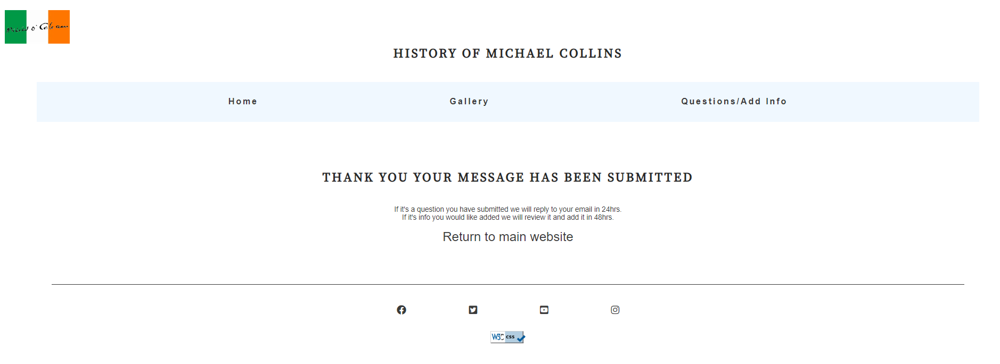

Welcome to, 
# HISTOTY OF MICHAEL COLLINS

This website provides a comprehensive overview of the life and accomplishments of Michael Collins, an influential figure in Irish history. From his role in the Irish War of Independence to his political career, this website aims to educate and inform visitors about the significant contributions made by Michael Collins. Here, you will find a wealth of information and resources about Collins, his role in shaping Irish history, and his enduring legacy.

The last update to this file was: **June 20th, 2023**

## Features
In this section we go over the features of the website, and show examples of the different sections.

- __Header navigation bar__

  - Featured on all three pages, the full responsive navigation bar includes links trough the Logo, Home page, Gallery and Questions/Add Info page, website name and is identical in each page to allow for easy navigation.
  - This section will allow the user to easily navigate from page to page across all devices without having to revert back to the previous page via the ‘back’ button. 

- __The Footer__ 

  - The footer section includes links to the relevant social media sites for the History of Michael Collins. The links will open to a new tab to allow easy navigation for the user. 
  - The footer is valuable to the user as it encourages them to keep connected via social media

- __Favicon__ 

  - The Favicon is the website's logo and will be on each page of the website it will use different sized favicon for different devices. 
  - This will show in the tabs header and allow the user to identify the website if they have multiple browser tabs open.

- __404 page__ 

  - A 404 page will will display if a user navigates to a broken link. 
  - The 404 page will allow the user to navigate back to the main website if they direct to a broken link/missing page, without the need of the browsers back button.

### Homepage
- The Homepage offers an interactive visual representation of the significant events in Michael Collins' life. 
- It allows users to navigate through key milestones and gain a better understanding of the chronology of his accomplishments and challenges.

- __Table of contents section__

  - The table of content's has links to each section of the timeline of Michael Collins life
  - This section introduces the user to information about Michael Collins also with an image of Michael Collins and some interesting facts

- __Timeline section__

  - The timeline section has multiple seperate paragraghs leading the user through Michael Collins life. 
  - There is an image relating to each paragraph with a description so the user can really get a feel for Michael Collins life. 

### Gallery

- The gallery will provide the user with supporting images with description and also embeded youtube documentary videos to provided more insight into Collins life. 
- This section is valuable to the user as they will get a lot more information about collins and a better feel for what it was like in collins time. 

### Questions/Add Info 

- This page will allow the user submit more info that they think we should add to the site, or ask any question they have. 
- On successful submission of the contact form, the user will be navigated to thank-you.html displaying a success message.. 
-  The form will consist of the following fields and attributes:
  - Name (required, type=text)
  - Email (required, type=email)
  - Message (required, type=textarea)

### Existing Features
- Responsive design
- Contact form and success page
- 404 Error page
- Gallery with images and embeded youtube documentaries

### Features Left to Implement

- Another feature idea we are thinking of implementing is another page for links to more information on collins and maybe more influenical irish figures in history.

## Design

### Wireframes

Homepage

## Technologies

- HTML
  - The structure of the Website was developed using HTML as the main language.
- CSS
  - The Website was styled using custom CSS in an external file.
-Visual Studio Code
  - The website was developed using Visual Studio Code IDE
- GitHub
  - Source code is hosted on GitHub and delpoyed using Git Pages.
- Git
  - Used to commit and push code during the development opf the Website
- Font Awesome
  - Icons obtained from [fontawesome](https://fontawesome.com/) were used as the Social media links in the footer section.
- Tinyjpg
  - https://tinyjpg.com/ was used to reduce the size of the images used throughout the website
- Favicon.io
  - favicon files were created at [favicon.io](fahttps://favicon.io/favicon-converter/)
- balsamiq
  - wireframes were created using balsamiq from [balsamiq.com](https://balsamiq.com/wireframes/desktop/#)

## Testing 

### Responsiveness

All pages were tested to ensure responsiveness on screen sizes from 320px and upwards as defined in [WCAG 2.1 Reflow criteria for responsive design](https://www.w3.org/WAI/WCAG21/Understanding/reflow.html) on Chrome, Edge, Firefox and Opera browsers.

Steps to test:

1. Open browser and navigate to [History of Michael Collins](https://jamie33o.github.io/history-of-michael-collins/ )
2. Open the developer tools (right click and inspect)
3. Set to responsive and decrease width to 320px
4. Set the zoom to 50%
5. Click and drag the responsive window to maximum width
6. Expected:

Website is responsive on all screen sizes and no images are pixelated or stretched. No horizontal scroll is present. No elements overlap.

Actual:

Website behaved as expected with the exception of some images been to large at 320px.

Website was also opened on the following devices and no responsive issues were seen:

Oukitel C21 Pro
TCL 30 Pro
iPhone SE
Samsung Galaxy Tablet

## Accessibility

[Wave Accessibility](https://wave.webaim.org/) tool was used throughout development and for final testing of the deployed website to check for any aid accessibility testing.

Testing was focused to ensure the following criteria were met:

All forms have associated labels so that this is read out on a screen reader to users
Color contrasts meet a minimum ratio as specified in WCAG 2.1 Contrast Guidelines
Heading levels are not missed or skipped to ensure the importance of content is relayed correctly to the end user
All content is contained within landmarks to ensure ease of use for assistive technology, allowing the user to navigate by page regions
All not textual content had alternative text or titles so descriptions are read out to screen readers
HTML page lang attribute has been set
Aria properties have been implemented correctly
WCAG 2.1 Coding best practices being followed

Manual tests were also performed to ensure the website was accessible as possible and an accessibility issue was identified.

Issue #1: Social media links in the footer had no text to explain what they link to.

Fix: added aria-label with name of site they link too.

Issue #2: some alt text for images was'nt descriptive.

Fix: change the alt text to better describe the image.

Issue #3: On the homepage the there was h3 tag before the h2 tag.

Fix: change the h3 to h2 and resized the text with css.

### Validator Testing 

- HTML
  - No errors were returned when passing through the official [W3C validator](https://validator.w3.org/nu/?doc=https%3A%2F%2Fjamie33o.github.io%2Fhistory-of-michael-collins%2F)
- CSS
  - No errors were found when passing through the official [(Jigsaw) validator](http://jigsaw.w3.org/css-validator/validator?lang=en&profile=css3svg&uri=https%3A%2F%2Fjamie33o.github.io%2Fhistory-of-michael-collins%2F&usermedium=all&vextwarning=&warning=1)

### Unfixed Bugs

The form section is currently not able to be submitted as it needs javascript and python to send the data and as this website is for education purposes we have not learnt these languages yet, but will be updated in the future.

## Deployment

This section should describe the process you went through to deploy the project to a hosting platform (e.g. GitHub) 

- The site was deployed to GitHub pages. The steps to deploy are as follows: 
  - In the GitHub repository, navigate to the Settings tab 
  - From the source section drop-down menu, select the Master Branch
  - Once the master branch has been selected, the page will be automatically refreshed with a detailed ribbon display to indicate the successful deployment. 

The live link can be found here - https://jamie33o.github.io/history-of-michael-collins/ 

## Credits 

Here we credit everywhere we have got content for the website and any code that was taken from other sources.

### Content 

- The text for the Home page was taken from ChatGPT.
- The icons in the footer were taken from [Font Awesome](https://fontawesome.com/)

### Media

- Videos in the gallery where taken from Youtube here is the links to eace channel in order
 1. [Michael Collins House Museum](https://www.youtube.com/@michaelcollinshouse)
 2. [Diolún Ó hUigínn](https://www.youtube.com/@Dioluin)
 3. [Documentales Olvidados](https://www.youtube.com/@Documentalesolvidado)

- The images in the gallery were taken from these pages in order
 1. [Michael collins statue in cork](https://laracurtis.blogspot.com/2021/04/michael-collins-ireland-history-michael.html)
 2. [Micheal collins giving a speech](https://www.pinterest.jp/pin/museum-all-about-michael-collins-to-open-on-easter-saturday--128915608061888154/)
 3. [Michael collins being interviewed by press](https://www.pinterest.com/pin/421086633909672221/)
 4. [An eerie last photo of collins, worried about the camera's shutter noise as he's grabbing for his gun](https://www.pinterest.com/pin/454300681146697950/)

### Code 

- Part of the code in the footer was taken from the love running walktrough tutorial on Code Institue.
- Part of the code in the form section was taken from love running walktrough tutorial on Code Institue.

Thank you for visiting the History Michael Collins website! We hope that this website enriches your understanding of this remarkable figure and his significant contributions to Irish history.